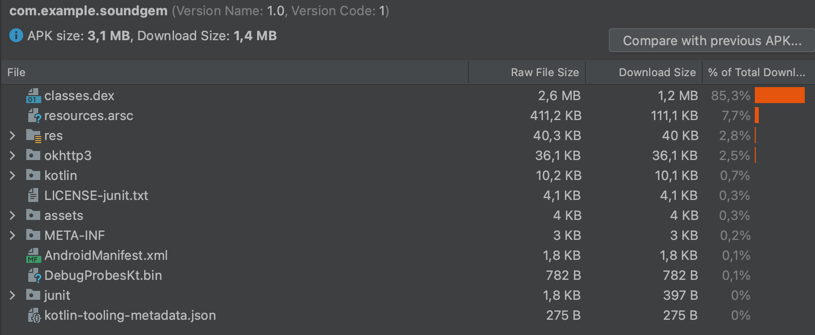

# Security improvements

## Shrinking apk

### Before shrinking


Enabling Minify and isShrinkSources to true

```javascript
 buildTypes {
        release {
            isMinifyEnabled = true
            isDebuggable = false
            isShrinkResources = true
            proguardFiles(
                getDefaultProguardFile("proguard-android-optimize.txt"),
                "proguard-rules.pro"
            )
        }
        debug {
            isDebuggable = true
            isMinifyEnabled = false
            isShrinkResources = false
        }
    }
```

In the debug mode, the app is the largest, as seen in the before screenshot. For testing purposes, we decided to only use the debug mode, as it increases the size of the .apk file the most.

In our release type, we enabled isMinifyEnabled and isShrinkResources, which both go hand in hand. After running the app again, we find that the raw .apk size has decreased substantionally.

### After shrinking



## Encrypting / Decrypting Data

### Encrypt

```kotlin
val plaintext = inputTxt.toByteArray()
val keygen = KeyGenerator.getInstance("AES")
keygen.init(256)
key = keygen.generateKey()
val cipher = Cipher.getInstance("AES/CBC/PKCS7Padding")
cipher.init(Cipher.ENCRYPT_MODE, key)
val ciphertext = cipher.doFinal(plaintext)
encryptedBA = ciphertext
iv = cipher.iv
encryptedTxt = ciphertext.contentToString()
```

### Decrypt

```kotlin
val cipher = Cipher.getInstance("AES/CBC/PKCS7Padding")
val ivSpec = IvParameterSpec(iv)
cipher.init(Cipher.DECRYPT_MODE, key, ivSpec)
val plaintext = cipher.doFinal(encryptedBA)
decryptedTxt = plaintext.decodeToString()
```
